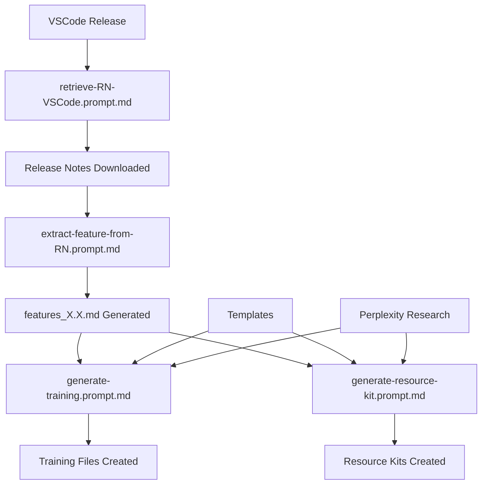

# VS Code Training Materials Generator

## 🎯 Project Overview

This project implements an **automated, prompt-driven workflow** for generating comprehensive training materials for Visual Studio Code features. The system uses structured prompt files to orchestrate AI-powered content creation, producing both theoretical documentation and hands-on learning resources.

### Key Benefits

- **Scalable Content Creation**: Generate training materials for new VS Code releases automatically
- **Consistent Quality**: Template-driven approach ensures uniform structure and coverage
- **Comprehensive Learning**: Creates both conceptual training and practical resource kits
- **Workflow Automation**: Prompt files orchestrate the entire content generation pipeline

## 🏗️ Architecture Overview

### The Prompt-Driven Workflow

The system operates through a series of interconnected prompt files that guide AI agents through the content creation process:



## 📁 Directory Structure

```
Training.GitHubCopilot/
├── .github/
│   └── prompts/                     # ⚡ Core Workflow Engine
│       ├── retrieve-RN-VSCode.prompt.md
│       ├── extract-feature-from-RN.prompt.md
│       ├── generate-training.prompt.md
│       └── generate-resource-kit.prompt.md
├── templates/
│   └── feature-training/            # 📝 Content Templates
│       ├── feature-training.md
│       └── resource-kit.md
├── features/                        # 📋 Feature Catalogs
│   └── features_1.102.md
├── release_notes/                   # 📰 Source Materials
│   └── vscode_1.102.md
└── trainings/                       # 📚 Generated Content
    └── 1.102/
        ├── feature_*.md             # Training Documents
        └── ResKit/
            └── reskit_*.md          # Resource Kits
```

## 🔄 Workflow Deep Dive

### Phase 1: Data Acquisition

#### `retrieve-RN-VSCode.prompt.md`

**Purpose**: Fetches the latest VS Code release notes from the official repository.

**Key Features**:

- Uses Perplexity API to find latest VS Code version
- Queries microsoft/vscode-docs repository via GitHub API
- Downloads release notes in original markdown format
- Creates version-specific files (`vscode_X.X.md`)

**AI Tools Used**: `perplexity-ask`, `github`

#### `extract-feature-from-RN.prompt.md`

**Purpose**: Parses release notes to extract a structured list of features.

**Process**:

1. Reads the downloaded release notes
2. Identifies and catalogs new features
3. Creates structured feature lists with descriptions
4. Generates `features_X.X.md` files for downstream processing

**Output Format**:

```markdown
# VS Code 1.102 Features

## Chat Enhancements
- **Custom Chat Modes**: Create specialized chat experiences...
- **MCP Protocol Support**: Connect to external data sources...

## Editor Experience
- **Auto-approval for Terminal Commands**: Streamline command execution...
```

### Phase 2: Content Generation

#### `generate-training.prompt.md`

**Purpose**: Creates comprehensive training documentation for each feature.

**Workflow**:

1. Reads feature catalog (`features_X.X.md`)
2. For each feature:
   - Uses Perplexity to research additional context
   - Applies the `feature-training.md` template
   - Generates structured training content
3. Saves files as `feature_[name].md` in version directory

**Template Structure**:

- **YAML Front Matter**: Metadata (feature, release, prerequisites, audience)
- **Overview Section**: Feature summary and primary benefits
- **Why It Matters**: Problem solved, target users, context
- **Feature Details**: Prerequisites, access methods, step-by-step usage
- **Practical Examples**: Code snippets, configuration samples
- **Common Use Cases**: Real-world scenarios
- **Integration**: How it works with other features
- **Troubleshooting**: Common issues and solutions

#### `generate-resource-kit.prompt.md`

**Purpose**: Creates hands-on learning materials with exercises and demos.

**Enhanced Capabilities**:

1. Generates complete directory structures
2. Creates starter files and solution templates
3. Develops step-by-step exercises
4. Builds interactive demos
5. Includes team workflow examples

**Resource Kit Components**:

- **Exercise Frameworks**: Guided practice with starter/solution files
- **Demo Walkthroughs**: Step-by-step demonstrations
- **Team Workflows**: Collaborative usage patterns
- **Enterprise Scenarios**: Large-scale deployment examples
- **Integration Patterns**: Multi-feature combinations

## 🎯 Template System

### Training Template (`feature-training.md`)

The training template ensures consistent, comprehensive coverage:

```yaml
---
feature: "[Feature Name]"
release: "[Release Version]"
prerequisites:
  - "[Prerequisite features]"
audience: "[Target users]"
---
```

**Content Sections**:

- **Overview**: Feature identification and summary
- **Why It Matters**: Value proposition and target audience
- **Feature Details**: Technical implementation and access
- **Step-by-Step Usage**: Practical instructions
- **Examples**: Code samples and configurations
- **Use Cases**: Real-world applications
- **Integration**: Cross-feature synergies
- **Troubleshooting**: Problem resolution

### Resource Kit Template (`resource-kit.md`)

The resource kit template creates immersive learning experiences:

```yaml
---
resource_type: "[Exercise | Demo | Both]"
audience: "[Target users]"
summary: |
  "[Learning objectives and outcomes]"
---
```

**Generated Structure**:

```
FeatureName_ResourceKit/
├── README.md                   # Overview and instructions
├── Exercise_01_Basic/
│   ├── instructions.md
│   ├── starter/               # Starting point files
│   ├── solution/              # Complete implementation
│   └── assets/                # Supporting materials
├── Demo_01_Advanced/
│   ├── walkthrough.md
│   ├── src/                   # Demo source code
│   └── assets/
└── Team_Workflows/
    ├── collaboration.md
    ├── enterprise_setup.md
    └── integration_patterns.md
```

## 🛠️ AI Tool Integration

### Perplexity API (`perplexity-ask`)

**Role**: External research and context gathering

**Usage Patterns**:

- Latest version discovery
- Feature research and validation
- Best practices identification
- Integration examples
- Troubleshooting scenarios

**Prompt Examples**:

```
"What is the latest version of Visual Studio Code and what are the key features in this release?"

"How does the new Custom Chat Modes feature in VS Code 1.102 work and what are practical use cases?"

"What are best practices for implementing MCP servers in VS Code development workflows?"
```

### GitHub API Integration

**Role**: Direct access to official documentation

**Capabilities**:

- Release notes retrieval from microsoft/vscode-docs
- Version-specific documentation access
- Official example extraction
- Change log analysis

### File System Operations

**Role**: Content organization and generation

**Operations**:

- Template reading and processing
- Directory structure creation
- Multi-file generation
- Content validation

## 📊 Output Quality Assurance

### Content Standards

1. **Completeness**: All template sections populated with relevant content
2. **Accuracy**: Information validated against official sources
3. **Consistency**: Uniform structure across all generated materials
4. **Practicality**: Actionable instructions and working examples
5. **Accessibility**: Clear language appropriate for target audience

### Template Compliance

Each generated file includes:

- **YAML Front Matter**: Machine-readable metadata
- **Structured Content**: Consistent section organization
- **Code Examples**: Practical implementation samples
- **Visual Indicators**: Emoji-based section markers for easy navigation

### Quality Metrics

- **Coverage**: All features from release notes addressed
- **Depth**: Comprehensive treatment of each feature
- **Usability**: Clear instructions and working examples
- **Maintenance**: Version-specific organization for easy updates

## 🚀 Usage Instructions

### For Content Creators

1. **Initial Setup**: Ensure all prompt files are configured
2. **Release Processing**: Run prompts in sequence for new VS Code releases
3. **Quality Review**: Validate generated content against standards
4. **Customization**: Modify templates for specific training needs

### For Learners

1. **Browse Features**: Start with `features_X.X.md` for overview
2. **Study Concepts**: Use training files for theoretical understanding
3. **Practice Skills**: Work through resource kit exercises
4. **Build Projects**: Apply demos to real-world scenarios

### For Trainers

1. **Curriculum Planning**: Use feature catalogs for course structure
2. **Material Preparation**: Leverage generated training documents
3. **Hands-on Sessions**: Deploy resource kits for interactive learning
4. **Assessment**: Use exercises for skill evaluation

## 🔧 Customization and Extension

### Adding New Prompt Files

1. Create prompt file in `.github/prompts/` directory
2. Define YAML front matter with description, mode, model, and tools
3. Write clear instructions for AI agent
4. Specify output format and file naming conventions

### Modifying Templates

1. Update template files in `templates/feature-training/`
2. Maintain YAML front matter structure
3. Preserve section organization for consistency
4. Test with existing prompt files

### Extending Workflows

1. Add new phases to the workflow pipeline
2. Create connecting prompt files for data flow
3. Update directory structure as needed
4. Document new workflow steps

## 📈 Benefits and Impact

### For Development Teams

- **Rapid Onboarding**: Comprehensive materials for new VS Code features
- **Consistent Training**: Standardized approach across all features
- **Skill Development**: Progressive learning from basics to advanced topics
- **Team Efficiency**: Ready-to-use training materials reduce preparation time

### For Organizations

- **Scalable Training**: Automated generation supports large teams
- **Quality Assurance**: Template-driven consistency ensures reliable content
- **Cost Effectiveness**: Reduced manual content creation effort
- **Rapid Deployment**: Quick adaptation to new VS Code releases

### For the Community

- **Knowledge Sharing**: Structured approach to feature documentation
- **Best Practices**: Curated examples and use cases
- **Accessibility**: Clear, comprehensive learning materials
- **Innovation**: Framework for exploring new VS Code capabilities

## 🔮 Future Enhancements

### Planned Improvements

1. **Interactive Demos**: Browser-based learning environments
2. **Video Generation**: Automated walkthrough creation
3. **Assessment Tools**: Skill evaluation and certification
4. **Multi-language Support**: Content in various programming languages
5. **Community Contributions**: Crowdsourced content validation

### Technical Evolution

- **Enhanced AI Models**: Leverage newer language models for improved content
- **Real-time Updates**: Automatic synchronization with VS Code releases
- **Quality Metrics**: Automated content assessment and improvement
- **Personalization**: Adaptive content based on user skill level

---

## 🤝 Contributing

This prompt-driven workflow system is designed for extensibility and community contribution. Whether you're adding new features, improving templates, or enhancing the automation pipeline, the structured approach ensures maintainable and scalable growth.

The future of developer education lies in intelligent, automated content generation that scales with the rapid pace of tool evolution. This project provides the foundation for that vision.
