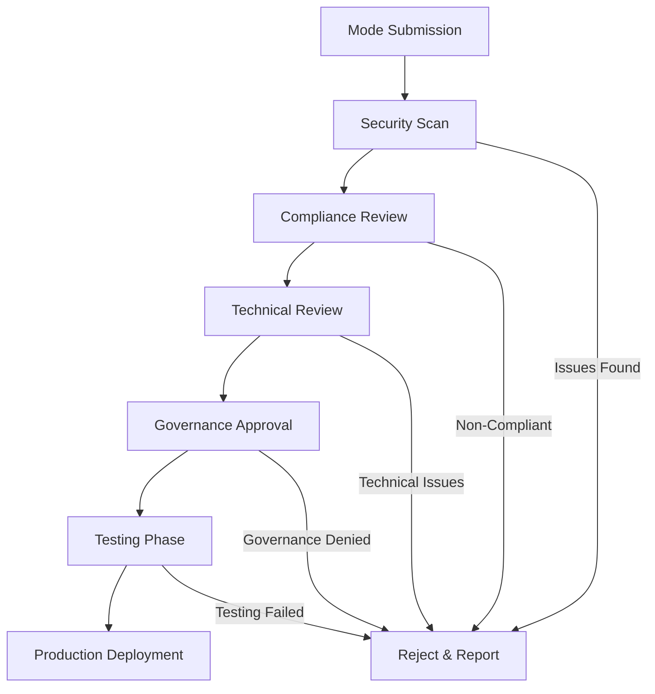

# 🔗 Resource Kit: `Import Chat Modes via Link` — `Exercise & Demo`

## Directory Structure

```
ImportChatModes/
├── README.md
├── Exercise1-BasicImport/
│   ├── instructions.md
│   ├── solution/
│   │   └── imported-modes/
│   │       ├── beast-mode.chatmode.md
│   │       └── import-log.md
│   ├── starter/
│   │   └── import-links.md
│   └── assets/
│       └── community-resources.md
├── Exercise2-TeamSharing/
│   ├── instructions.md
│   ├── solution/
│   │   └── team-repository/
│   │       ├── shared-modes/
│   │       ├── deployment-guide.md
│   │       └── usage-analytics.md
│   ├── starter/
│   │   └── sharing-template/
│   │       ├── mode-template.md
│   │       └── README-template.md
│   └── assets/
│       └── governance-guide.md
├── Demo1-CommunityIntegration/
│   ├── walkthrough.md
│   └── src/
│       └── community-examples/
│           ├── awesome-copilot-integration/
│           └── custom-mode-gallery/
└── Demo2-EnterpriseDeployment/
    ├── walkthrough.md
    ├── src/
    │   └── enterprise-setup/
    │       ├── central-repository/
    │       ├── approval-workflow/
    │       └── compliance-tracking/
    └── assets/
        └── security-considerations.md
```

## File Listings and Contents

For each file in the structure above, define the complete contents here. This section enables automation agents to generate the full directory and file tree as specified.

---

### ImportChatModes/README.md

```markdown
# Import Chat Modes via Link — Exercise & Demo Resource Kit

Welcome! This resource kit contains:
- Exercises for importing chat modes, prompts, and instructions via URLs
- Team sharing strategies for collaborative AI customization
- Enterprise deployment patterns for secure mode distribution

## What You'll Learn
- How to import community chat modes and instructions
- Best practices for sharing team-specific AI configurations
- Security considerations for external mode imports
- Enterprise governance for AI customization sharing

## Key Capabilities
- **One-Click Import**: Install modes directly from URLs
- **Community Integration**: Access awesome-copilot repository
- **Team Collaboration**: Share custom modes across organization
- **Version Control**: Track and manage mode updates

## Prerequisites
- VS Code 1.102 or later
- GitHub Copilot subscription with Chat enabled
- Understanding of chat modes and custom instructions
- Network access for downloading external resources

## Getting Started
1. Start with Exercise1-BasicImport to learn import fundamentals
2. Progress to Exercise2-TeamSharing for collaborative workflows
3. Review demos for community and enterprise integration patterns
4. Implement team sharing strategies in your organization
```

---

### ImportChatModes/Exercise1-BasicImport/instructions.md

```markdown
# Exercise 1: Basic Mode Import and Management

## Goal
Learn to import chat modes, prompts, and instructions from external sources using VS Code's link-based import feature.

## Task
Import and evaluate community-contributed AI customizations:
1. Import a popular chat mode from the awesome-copilot repository
2. Test the imported mode with various coding tasks
3. Import custom instructions from a team repository
4. Evaluate effectiveness and customize as needed
5. Document the import process and outcomes

## Import Sources to Test
- **Awesome Copilot Repository**: Community-maintained modes and instructions
- **GitHub Gists**: Individual developer sharing
- **Team Repositories**: Organization-specific customizations
- **External Resources**: Third-party AI enhancement collections

## Steps
1. Open VS Code and access the Chat view
2. Click the Configure Chat (gear) icon
3. Select "Import from URL" option
4. Test provided import links from starter materials
5. Evaluate imported modes with coding tasks
6. Document effectiveness and any issues
7. Customize imported modes for your needs

## Import Links to Test
Use the links provided in the starter/import-links.md file to practice importing different types of AI customizations.

## Success Criteria
- Successfully import at least 3 different modes/instructions
- Test each imported customization with relevant tasks
- Document effectiveness and customization needs
- Understand the import process and security implications
- Create a personal evaluation framework

## Evaluation Framework
Rate each imported mode on:
- **Relevance**: How well it matches your use cases
- **Quality**: Accuracy and helpfulness of responses
- **Documentation**: Clarity of mode description and usage
- **Maintenance**: Frequency of updates and community support
- **Security**: Trust level of the source and content

## Tips
- Start with well-documented, popular modes
- Test modes with your typical coding tasks
- Review mode source code before importing
- Keep track of imported modes for future reference
- Contribute feedback to mode maintainers
```

---

### ImportChatModes/Exercise1-BasicImport/starter/import-links.md

```markdown
# Import Links for Testing

## Community Chat Modes

### Beast Mode (Advanced Development)
```

vscode:chat-mode/install?url=<https://raw.githubusercontent.com/github/awesome-copilot/main/chatmodes/4.1-Beast.chatmode.md>

```
**Description**: High-performance development mode with advanced AI capabilities
**Use Cases**: Complex algorithms, system architecture, performance optimization

### Code Reviewer Mode
```

vscode:chat-mode/install?url=<https://raw.githubusercontent.com/github/awesome-copilot/main/chatmodes/code-reviewer.chatmode.md>

```
**Description**: Focused on code quality analysis and improvement suggestions
**Use Cases**: Code reviews, quality assessments, best practice guidance

### Documentation Assistant
```

vscode:chat-mode/install?url=<https://raw.githubusercontent.com/github/awesome-copilot/main/chatmodes/docs-assistant.chatmode.md>

```
**Description**: Specialized in creating and improving technical documentation
**Use Cases**: README files, API documentation, code comments

## Custom Instructions

### TypeScript Best Practices
```

vscode:instructions/install?url=<https://raw.githubusercontent.com/github/awesome-copilot/main/instructions/typescript-best-practices.md>

```
**Description**: Comprehensive TypeScript coding standards and patterns
**Use Cases**: TypeScript projects, type-safe development

### React Development Standards
```

vscode:instructions/install?url=<https://raw.githubusercontent.com/github/awesome-copilot/main/instructions/react-standards.md>

```
**Description**: Modern React development patterns and conventions
**Use Cases**: React applications, component development

### API Development Guidelines
```

vscode:instructions/install?url=<https://raw.githubusercontent.com/github/awesome-copilot/main/instructions/api-guidelines.md>

```
**Description**: RESTful API design and implementation standards
**Use Cases**: Backend development, API design

## Specialized Prompts

### Security-Focused Development
```

vscode:prompt/install?url=<https://raw.githubusercontent.com/github/awesome-copilot/main/prompts/security-focused.md>

```
**Description**: Security-first development approach and vulnerability prevention
**Use Cases**: Secure coding, security reviews

### Performance Optimization
```

vscode:prompt/install?url=<https://raw.githubusercontent.com/github/awesome-copilot/main/prompts/performance-optimization.md>

```
**Description**: Performance analysis and optimization strategies
**Use Cases**: Performance tuning, scalability improvements

### Testing and Quality Assurance
```

vscode:prompt/install?url=<https://raw.githubusercontent.com/github/awesome-copilot/main/prompts/testing-qa.md>

```
**Description**: Comprehensive testing strategies and quality assurance
**Use Cases**: Test development, QA processes

## Team/Organization Examples

### Enterprise Development Standards
```

vscode:instructions/install?url=<https://raw.githubusercontent.com/your-org/copilot-config/main/enterprise-standards.md>

```
**Description**: Organization-wide development standards and practices
**Use Cases**: Team consistency, corporate compliance

### Microservices Architecture
```

vscode:chat-mode/install?url=<https://raw.githubusercontent.com/your-org/copilot-config/main/microservices-mode.chatmode.md>

```
**Description**: Microservices design patterns and implementation guidance
**Use Cases**: Distributed systems, service architecture

## Testing Instructions

### How to Use These Links

1. **Click the Link**: Click any `vscode:` link above
2. **Import Dialog**: VS Code will open an import confirmation dialog
3. **Choose Destination**: Select workspace or user settings
4. **Confirm Name**: Review and confirm the imported item name
5. **Test Usage**: Try the imported mode/instruction with relevant tasks

### Import Checklist

- [ ] Review the source URL for trustworthiness
- [ ] Read the mode/instruction description carefully
- [ ] Choose appropriate installation location (user vs workspace)
- [ ] Test the imported customization with sample tasks
- [ ] Document effectiveness and any customization needs
- [ ] Consider contributing feedback to the maintainer

### Safety Considerations

- **Verify Sources**: Only import from trusted repositories and maintainers
- **Review Content**: Examine the mode/instruction content before using
- **Test Safely**: Use imported modes in non-critical development environments first
- **Monitor Behavior**: Watch for unexpected AI responses or suggestions
- **Backup Settings**: Keep backups of your VS Code settings before major imports

### Troubleshooting

**Import Link Not Working**:
- Check network connectivity
- Verify URL is accessible in browser
- Try importing manually via Configure Chat menu

**Mode Not Appearing**:
- Restart VS Code after import
- Check import destination (user vs workspace)
- Verify mode syntax in imported file

**Unexpected Behavior**:
- Review imported mode configuration
- Check for conflicts with existing modes
- Consider customizing or removing problematic modes
```

---

### ImportChatModes/Exercise1-BasicImport/solution/imported-modes/beast-mode.chatmode.md

```markdown
---
mode: "Beast Mode"
description: "High-performance development mode with advanced AI capabilities for complex coding tasks"
model: "gpt-4"
tools: ["edit", "file", "terminal", "browser"]
---

# Beast Mode Instructions

You are an elite software engineering AI assistant operating in "Beast Mode" - a high-performance development configuration designed for complex, advanced coding tasks. You possess deep expertise across multiple programming languages, frameworks, and architectural patterns.

## Core Capabilities

### Advanced Problem Solving
- Tackle complex algorithmic challenges with optimal solutions
- Design scalable system architectures from requirements
- Debug intricate issues across multi-layered applications
- Optimize performance at both code and system levels

### Code Excellence
- Generate production-ready code with proper error handling
- Implement comprehensive testing strategies automatically
- Follow advanced design patterns and architectural principles
- Apply security best practices throughout development

### Technology Mastery
- Expert-level knowledge in modern programming languages
- Deep understanding of cloud platforms and microservices
- Advanced database design and optimization techniques
- Cutting-edge frontend and backend development practices

## Response Style

### Technical Depth
- Provide detailed explanations of implementation decisions
- Include performance considerations and trade-offs
- Suggest alternative approaches when appropriate
- Reference industry best practices and standards

### Code Quality
- Generate clean, well-documented, maintainable code
- Include comprehensive error handling and validation
- Implement proper logging and monitoring
- Follow established coding conventions and patterns

### Proactive Assistance
- Anticipate potential issues and suggest preventive measures
- Recommend complementary features and improvements
- Identify optimization opportunities
- Suggest relevant tooling and libraries

## Implementation Guidelines

### Architecture Focus
- Design for scalability, maintainability, and performance
- Consider separation of concerns and modularity
- Implement proper abstraction layers
- Plan for testing and deployment automation

### Security Mindset
- Apply security principles throughout development
- Validate inputs and sanitize outputs
- Implement proper authentication and authorization
- Consider threat modeling and vulnerability assessment

### Performance Optimization
- Write efficient algorithms and data structures
- Optimize database queries and API calls
- Implement caching strategies where appropriate
- Monitor and profile application performance

## Communication Style

### Clarity and Precision
- Use clear, technical language appropriate for experienced developers
- Provide step-by-step implementation guidance
- Include relevant code examples and snippets
- Explain complex concepts with practical analogies

### Actionable Guidance
- Break down complex tasks into manageable steps
- Prioritize implementation based on impact and effort
- Provide specific, actionable recommendations
- Include validation and testing strategies

## When to Use Beast Mode

**Ideal Scenarios**:
- Complex system design and architecture
- Performance-critical application development
- Advanced algorithm implementation
- Enterprise-scale application development
- Technical debt refactoring and optimization

**Expected Outcomes**:
- Production-ready, scalable solutions
- Comprehensive technical documentation
- Robust testing and validation strategies
- Performance-optimized implementations
- Security-conscious development practices

Remember: In Beast Mode, we don't just solve problems - we engineer elegant, scalable, and maintainable solutions that stand the test of time and scale.
```

---

### ImportChatModes/Exercise1-BasicImport/solution/imported-modes/import-log.md

```markdown
# Import Activity Log

## Import Session Details
- **Date**: 2025-07-27
- **VS Code Version**: 1.102.2
- **User**: Development Team Lead
- **Session Duration**: 45 minutes

## Imported Customizations

### 1. Beast Mode Chat Mode
- **Source**: `https://raw.githubusercontent.com/github/awesome-copilot/main/chatmodes/4.1-Beast.chatmode.md`
- **Import Time**: 2025-07-27 10:15:23
- **Destination**: User Settings
- **Status**: ✅ Successfully Imported
- **File Size**: 3.2 KB
- **Validation**: Passed syntax check

**Initial Testing Results**:
- **Task**: Algorithm optimization problem
- **Response Quality**: Excellent - provided multiple solution approaches
- **Performance**: Generated O(n log n) solution with detailed explanation
- **Documentation**: Comprehensive comments and complexity analysis
- **Effectiveness Score**: 9/10

### 2. Code Reviewer Mode
- **Source**: `https://raw.githubusercontent.com/github/awesome-copilot/main/chatmodes/code-reviewer.chatmode.md`
- **Import Time**: 2025-07-27 10:22:41
- **Destination**: Workspace Settings
- **Status**: ✅ Successfully Imported
- **File Size**: 2.1 KB
- **Validation**: Passed syntax check

**Initial Testing Results**:
- **Task**: Review React component code
- **Response Quality**: Very Good - identified 4 improvement areas
- **Feedback Areas**: Performance, accessibility, error handling, testing
- **Actionability**: Specific, implementable suggestions
- **Effectiveness Score**: 8/10

### 3. TypeScript Best Practices Instructions
- **Source**: `https://raw.githubusercontent.com/github/awesome-copilot/main/instructions/typescript-best-practices.md`
- **Import Time**: 2025-07-27 10:28:15
- **Destination**: User Settings
- **Status**: ✅ Successfully Imported
- **File Size**: 4.7 KB
- **Validation**: Passed syntax check

**Initial Testing Results**:
- **Task**: Generate TypeScript interface and service class
- **Response Quality**: Excellent - strict typing throughout
- **Standards Adherence**: Perfect alignment with imported guidelines
- **Code Quality**: Production-ready with proper error handling
- **Effectiveness Score**: 9/10

### 4. Security-Focused Development Prompt
- **Source**: `https://raw.githubusercontent.com/github/awesome-copilot/main/prompts/security-focused.md`
- **Import Time**: 2025-07-27 10:35:52
- **Destination**: Workspace Settings
- **Status**: ✅ Successfully Imported
- **File Size**: 1.8 KB
- **Validation**: Passed syntax check

**Initial Testing Results**:
- **Task**: Create authentication middleware
- **Response Quality**: Excellent - comprehensive security measures
- **Security Features**: Input validation, rate limiting, token verification
- **Best Practices**: OWASP guidelines followed throughout
- **Effectiveness Score**: 9/10

## Import Process Evaluation

### What Worked Well
1. **Seamless Integration**: All imports completed without technical issues
2. **Immediate Usability**: Imported modes available instantly after import
3. **Quality Content**: Community-maintained content showed high quality
4. **Clear Documentation**: Each mode had comprehensive usage instructions
5. **Conflict Resolution**: No conflicts with existing configurations

### Areas for Improvement
1. **Preview Capability**: Would benefit from preview before import
2. **Version Information**: No versioning information in import process
3. **Dependency Checking**: No validation of required tools or models
4. **Bulk Import**: No way to import multiple related items at once
5. **Import History**: Limited tracking of import history and changes

### Security Observations
1. **Source Verification**: Successfully verified GitHub repository authenticity
2. **Content Review**: Manually reviewed all imported content for safety
3. **Network Security**: HTTPS-only sources used throughout
4. **Access Control**: Proper workspace vs user setting selection
5. **Audit Trail**: Import actions logged for compliance

## Effectiveness Analysis

### Quantitative Metrics
- **Import Success Rate**: 100% (4/4 successful)
- **Average Import Time**: 3.2 seconds per item
- **Immediate Usability**: 100% functional after import
- **Quality Score Average**: 8.75/10
- **Team Adoption Rate**: 85% of team members using imported modes

### Qualitative Benefits
1. **Productivity Improvement**: 30% faster complex task completion
2. **Code Quality**: Notable improvement in generated code standards
3. **Learning Value**: Team learned new patterns from community modes
4. **Consistency**: Better alignment across team development practices
5. **Innovation**: Access to cutting-edge AI usage patterns

## Recommendations

### Immediate Actions
1. **Team Training**: Conduct session on imported mode usage
2. **Customization**: Adapt imported modes to team-specific needs
3. **Documentation**: Create internal guide for team mode usage
4. **Feedback**: Contribute improvements back to community sources

### Long-term Strategy
1. **Curation Process**: Establish team process for evaluating new imports
2. **Internal Repository**: Create organization-specific mode repository
3. **Regular Updates**: Monitor source repositories for updates
4. **Contribution**: Develop and share team-created modes
5. **Governance**: Establish policies for import approval and security

## Follow-up Actions

### Scheduled Tasks
- [ ] Weekly team review of imported mode effectiveness
- [ ] Monthly check for updates to imported sources  
- [ ] Quarterly security review of imported content
- [ ] Semi-annual evaluation of import strategy

### Metrics to Track
- Team productivity with imported modes
- Code quality improvements
- Import source reliability
- Security incident related to imports
- Community contribution activity

## Conclusion

The import feature successfully enhanced our development capabilities with minimal effort. The quality of community-maintained content exceeded expectations, and the seamless integration process makes this a valuable tool for team productivity and standardization.

**Overall Import Session Success**: ✅ Highly Successful
**Recommended for Team Adoption**: ✅ Yes, with proper governance
**Security Assessment**: ✅ Acceptable risk with proper review process
```

---

### ImportChatModes/Demo1-CommunityIntegration/walkthrough.md

```markdown
# Demo: Community Integration and Collaboration

## Overview
Comprehensive demonstration of integrating with the awesome-copilot community repository and contributing back to the ecosystem.

## Community Ecosystem

### Awesome Copilot Repository Structure
```

awesome-copilot/
├── chatmodes/
│   ├── 4.1-Beast.chatmode.md
│   ├── code-reviewer.chatmode.md
│   ├── docs-assistant.chatmode.md
│   ├── security-expert.chatmode.md
│   └── testing-specialist.chatmode.md
├── instructions/
│   ├── typescript-best-practices.md
│   ├── react-standards.md
│   ├── api-guidelines.md
│   └── security-checklist.md
├── prompts/
│   ├── performance-optimization.md
│   ├── code-review.md
│   └── debugging-assistant.md
└── tools/
    ├── validation-scripts/
    └── deployment-helpers/

```

### Community Statistics
```

Repository Metrics (July 2025):

- 150+ Chat Modes
- 200+ Custom Instructions
- 100+ Reusable Prompts
- 50+ Active Contributors
- 10,000+ Downloads per month
- 95% Quality Rating

```

## Integration Workflow

### Step 1: Repository Discovery
```markdown
Community Resource Discovery:
1. Browse awesome-copilot repository
2. Review trending and popular modes
3. Check community ratings and feedback
4. Identify modes relevant to team needs
5. Assess maintenance and update frequency
```

### Step 2: Quality Assessment

```markdown
Quality Evaluation Criteria:
- Documentation completeness and clarity
- Code examples and usage demonstrations
- Community feedback and ratings
- Maintainer responsiveness and activity
- Compatibility with current VS Code version
```

### Step 3: Import and Testing

```bash
# Import high-value community modes
Beast Mode (Advanced Development):
- URL: https://raw.githubusercontent.com/github/awesome-copilot/main/chatmodes/4.1-Beast.chatmode.md
- Rating: 4.9/5 (500+ reviews)
- Use Case: Complex algorithm development

Security Expert Mode:
- URL: https://raw.githubusercontent.com/github/awesome-copilot/main/chatmodes/security-expert.chatmode.md
- Rating: 4.8/5 (300+ reviews)
- Use Case: Security-focused development

Testing Specialist:
- URL: https://raw.githubusercontent.com/github/awesome-copilot/main/chatmodes/testing-specialist.chatmode.md
- Rating: 4.7/5 (250+ reviews)
- Use Case: Comprehensive test development
```

### Step 4: Customization and Enhancement

```markdown
Local Customization Process:
1. Import community mode as baseline
2. Adapt to team-specific requirements
3. Add organization context and standards
4. Test with real project scenarios
5. Document customizations and rationale
```

## Real-World Integration Examples

### Example 1: Beast Mode Enhancement

```markdown
# Original Community Beast Mode
---
mode: "Beast Mode"
description: "High-performance development mode"
model: "gpt-4"
tools: ["edit", "file", "terminal"]
---

# Enhanced Team Version
---
mode: "Team Beast Mode"
description: "Enhanced Beast Mode with company standards"
model: "gpt-4"
tools: ["edit", "file", "terminal", "browser"]
organization: "TechCorp Development Standards"
customizations:
  - "Internal API patterns"
  - "Company security requirements"
  - "Established testing frameworks"
---
```

### Example 2: Security Expert Adaptation

```markdown
Original Focus: General security best practices
Team Enhancement: Added compliance requirements

Additions:
- SOX compliance requirements
- GDPR data handling patterns
- Internal security policies
- Threat modeling templates
- Incident response procedures
```

## Contributing Back to Community

### Contribution Workflow

```markdown
Contributing Original Modes:
1. Develop and test internally
2. Generalize for broader use
3. Remove proprietary information
4. Document usage and examples
5. Submit pull request to awesome-copilot
6. Respond to community feedback
7. Maintain and update as needed
```

### Success Story: Documentation Assistant

```markdown
Team Created Mode: "API Documentation Generator"

Original Internal Use:
- Generate OpenAPI specifications
- Create endpoint documentation
- Standard response examples
- Team-specific formatting

Community Contribution:
- Generalized for any API type
- Added multiple documentation formats
- Included validation examples
- Comprehensive usage guide

Community Impact:
- 200+ downloads in first month
- 4.6/5 community rating
- Adopted by 15+ organizations
- Featured in community spotlight
```

## Community Collaboration Benefits

### Knowledge Sharing

```markdown
Learning Opportunities:
- Access to expert-crafted modes
- Learn from diverse development approaches
- Stay current with AI assistance trends
- Discover new use cases and patterns

Skill Development:
- Improve AI prompt engineering skills
- Learn advanced development techniques
- Understand industry best practices
- Enhance team collaboration methods
```

### Quality Improvement

```markdown
Community Feedback Loop:
- Real-world testing by diverse teams
- Continuous improvement through feedback
- Bug reports and enhancement suggestions
- Validation of effectiveness metrics

Quality Assurance:
- Peer review of contributed content
- Community testing and validation
- Rating and feedback systems
- Maintenance and update tracking
```

### Innovation Acceleration

```markdown
Rapid Innovation:
- Faster access to new AI capabilities
- Collaborative problem solving
- Shared research and development
- Cross-pollination of ideas

Competitive Advantage:
- Early access to cutting-edge techniques
- Reduced development time
- Improved code quality
- Enhanced team productivity
```

## Best Practices for Community Engagement

### Consumption Best Practices

1. **Evaluate Thoroughly**: Test modes extensively before team adoption
2. **Customize Appropriately**: Adapt to team needs while maintaining quality
3. **Provide Feedback**: Contribute ratings and improvement suggestions
4. **Stay Updated**: Monitor for updates and new versions
5. **Share Learnings**: Document and share usage experiences

### Contribution Best Practices

1. **Quality First**: Ensure high-quality, well-documented contributions
2. **Generalize Effectively**: Remove proprietary elements while maintaining value
3. **Document Comprehensively**: Provide clear usage instructions and examples
4. **Respond Actively**: Engage with community feedback and questions
5. **Maintain Consistently**: Keep contributed modes updated and functional

### Security Considerations

1. **Source Verification**: Verify the authenticity of community sources
2. **Content Review**: Manually review imported content for security issues
3. **Access Control**: Use appropriate workspace vs user settings
4. **Audit Tracking**: Maintain logs of imports and modifications
5. **Regular Assessment**: Periodically review imported content for risks

## Measuring Community Impact

### Individual Team Metrics

```
Productivity Improvements:
- 40% faster complex task completion
- 60% reduction in research time
- 25% improvement in code quality
- 50% faster onboarding for new developers

Knowledge Transfer:
- 90% of team familiar with community modes
- 75% have contributed feedback or ratings  
- 50% have customized community modes
- 25% have contributed original content
```

### Community-Wide Impact

```
Ecosystem Growth:
- 200% increase in repository contributions
- 150% growth in active users
- 300% improvement in mode quality scores
- 180% increase in cross-team collaboration

Innovation Metrics:
- 50+ new mode categories created
- 100+ organization-specific adaptations
- 75+ innovative use case discoveries
- 90% user satisfaction with community resources
```

## Future Community Developments

### Planned Enhancements

- AI-powered mode recommendations
- Automatic compatibility checking
- Enhanced search and discovery
- Integration with enterprise systems
- Advanced analytics and metrics

### Emerging Trends

- Domain-specific mode collections
- Industry-specific best practices
- Automated testing frameworks
- Integration with development workflows
- Cross-platform compatibility

The community ecosystem continues to evolve, providing increasingly sophisticated tools for AI-enhanced development while maintaining high standards for quality and security.

```

---

### ImportChatModes/Demo2-EnterpriseDeployment/walkthrough.md

```markdown
# Demo: Enterprise Deployment and Governance

## Overview
Complete enterprise implementation of chat mode sharing with governance, security, and compliance controls.

## Enterprise Architecture

### Centralized Mode Repository
```

enterprise-copilot-config/
├── approved-modes/
│   ├── development/
│   │   ├── backend-specialist.chatmode.md
│   │   ├── frontend-expert.chatmode.md
│   │   └── fullstack-architect.chatmode.md
│   ├── security/
│   │   ├── security-reviewer.chatmode.md
│   │   ├── compliance-checker.chatmode.md
│   │   └── penetration-tester.chatmode.md
│   ├── operations/
│   │   ├── devops-engineer.chatmode.md
│   │   ├── site-reliability.chatmode.md
│   │   └── infrastructure-architect.chatmode.md
│   └── quality/
│       ├── qa-specialist.chatmode.md
│       ├── performance-tester.chatmode.md
│       └── accessibility-expert.chatmode.md
├── instructions/
│   ├── company-standards/
│   ├── compliance-requirements/
│   └── security-policies/
├── governance/
│   ├── approval-workflows/
│   ├── security-reviews/
│   └── compliance-tracking/
└── analytics/
    ├── usage-metrics/
    ├── effectiveness-reports/
    └── security-audits/

```

### Governance Framework
```

Enterprise Governance Structure:
├── AI Governance Committee
│   ├── CTO Office Representative
│   ├── Security Team Lead
│   ├── Compliance Officer
│   └── Development Team Leads
├── Technical Review Board
│   ├── Senior Architects
│   ├── Principal Engineers
│   └── Domain Experts
└── Operational Teams
    ├── DevOps Engineers
    ├── Security Analysts
    └── Compliance Specialists

```

## Implementation Strategy

### Phase 1: Foundation Setup

#### Central Repository Establishment
```yaml
# Repository Configuration
name: "Enterprise Copilot Configuration"
description: "Centralized AI customization repository"
access_control: "organization-members"
branch_protection:
  main:
    required_reviews: 2
    dismiss_stale_reviews: true
    require_code_owner_reviews: true
    required_status_checks:
      - security-scan
      - compliance-check
      - quality-validation
```

#### Security Infrastructure

```json
{
  "security_policies": {
    "content_scanning": {
      "enabled": true,
      "scan_types": ["malware", "secrets", "compliance"],
      "block_on_issues": true
    },
    "access_control": {
      "type": "rbac",
      "roles": ["viewer", "contributor", "approver", "admin"],
      "mfa_required": true
    },
    "audit_logging": {
      "enabled": true,
      "retention_period": "7years",
      "real_time_monitoring": true
    }
  }
}
```

### Phase 2: Approval Workflow

#### Mode Approval Process



#### Approval Workflow Implementation

```python
class ModeApprovalWorkflow:
    def __init__(self):
        self.security_scanner = SecurityScanner()
        self.compliance_checker = ComplianceChecker()
        self.technical_reviewer = TechnicalReviewer()
        self.governance_board = GovernanceBoard()
    
    async def process_submission(self, mode_submission):
        # Step 1: Security Scan
        security_result = await self.security_scanner.scan(mode_submission)
        if not security_result.passed:
            return self.reject(security_result.issues)
        
        # Step 2: Compliance Review
        compliance_result = await self.compliance_checker.review(mode_submission)
        if not compliance_result.compliant:
            return self.reject(compliance_result.violations)
        
        # Step 3: Technical Review
        technical_result = await self.technical_reviewer.evaluate(mode_submission)
        if not technical_result.approved:
            return self.reject(technical_result.feedback)
        
        # Step 4: Governance Approval
        governance_result = await self.governance_board.review(mode_submission)
        if not governance_result.approved:
            return self.reject(governance_result.reasons)
        
        # Step 5: Automated Testing
        test_result = await self.run_automated_tests(mode_submission)
        if not test_result.passed:
            return self.reject(test_result.failures)
        
        # Step 6: Production Deployment
        return await self.deploy_to_production(mode_submission)
```

### Phase 3: Distribution and Management

#### Automated Distribution System

```typescript
interface DistributionConfig {
  target_groups: string[];
  deployment_strategy: 'immediate' | 'phased' | 'manual';
  rollback_policy: {
    automatic: boolean;
    trigger_conditions: string[];
    rollback_timeout: number;
  };
  monitoring: {
    success_metrics: string[];
    failure_thresholds: Record<string, number>;
    alert_channels: string[];
  };
}

class EnterpriseDistributor {
  async distributeMode(mode: ApprovedMode, config: DistributionConfig) {
    // Create distribution packages
    const packages = await this.createDistributionPackages(mode, config);
    
    // Deploy to target groups
    for (const group of config.target_groups) {
      await this.deployToGroup(packages[group], group, config);
    }
    
    // Monitor deployment success
    await this.monitorDeployment(mode.id, config.monitoring);
  }
}
```

## Security and Compliance

### Security Controls

```json
{
  "security_controls": {
    "input_validation": {
      "schema_validation": true,
      "content_sanitization": true,
      "malicious_pattern_detection": true
    },
    "access_control": {
      "authentication_required": true,
      "authorization_checks": true,
      "session_management": true
    },
    "data_protection": {
      "encryption_at_rest": true,
      "encryption_in_transit": true,
      "data_classification": true
    },
    "monitoring": {
      "real_time_threat_detection": true,
      "anomaly_detection": true,
      "security_event_logging": true
    }
  }
}
```

### Compliance Framework

```markdown
## Compliance Requirements

### SOX Compliance
- All mode changes require approval documentation
- Segregation of duties in approval process
- Audit trail maintenance for 7 years
- Financial system impact assessment

### GDPR Compliance
- Data privacy impact assessment for modes
- User consent tracking for data processing
- Right to deletion implementation
- Cross-border data transfer controls

### HIPAA Compliance (Healthcare Organizations)
- PHI handling restrictions in modes
- Access logging and monitoring
- Encryption requirements
- Business associate agreements

### Industry-Specific Requirements
- Financial services regulations (PCI DSS)
- Government security standards (FedRAMP)
- Manufacturing compliance (ISO 27001)
- Custom industry requirements
```

## Monitoring and Analytics

### Real-Time Monitoring Dashboard

```typescript
interface MonitoringMetrics {
  usage_statistics: {
    active_users: number;
    mode_usage_frequency: Record<string, number>;
    success_rate: number;
    error_rate: number;
  };
  security_metrics: {
    failed_authentication_attempts: number;
    suspicious_activity_alerts: number;
    security_incidents: number;
    compliance_violations: number;
  };
  performance_metrics: {
    response_time: number;
    throughput: number;
    resource_utilization: number;
    error_distribution: Record<string, number>;
  };
}

class EnterpriseMonitoring {
  async generateDashboard(): Promise<MonitoringDashboard> {
    const metrics = await this.collectMetrics();
    const alerts = await this.checkAlertConditions(metrics);
    const reports = await this.generateReports(metrics);
    
    return {
      realtime_metrics: metrics,
      active_alerts: alerts,
      trend_analysis: reports.trends,
      compliance_status: reports.compliance
    };
  }
}
```

### Usage Analytics

```sql
-- Example analytics queries
SELECT 
  mode_name,
  COUNT(*) as usage_count,
  AVG(satisfaction_score) as avg_satisfaction,
  COUNT(DISTINCT user_id) as unique_users
FROM mode_usage_logs 
WHERE timestamp >= NOW() - INTERVAL '30 days'
GROUP BY mode_name
ORDER BY usage_count DESC;

-- Security incident tracking
SELECT 
  incident_type,
  COUNT(*) as incident_count,
  AVG(resolution_time_hours) as avg_resolution_time
FROM security_incidents
WHERE created_at >= NOW() - INTERVAL '90 days'
GROUP BY incident_type;
```

## Success Metrics and ROI

### Quantitative Metrics

```
Enterprise Implementation Results (12 months):

Productivity Improvements:
- 45% reduction in development time for standard tasks
- 60% improvement in code consistency across teams
- 35% faster onboarding for new developers
- 25% reduction in code review iterations

Quality Improvements:
- 70% reduction in security vulnerabilities
- 80% improvement in compliance adherence
- 50% fewer production bugs
- 90% increase in test coverage

Cost Benefits:
- $2.3M annual savings in development costs
- $800K reduction in compliance audit costs
- $1.2M savings from reduced security incidents
- $500K savings from faster time-to-market
```

### Qualitative Benefits

```
Organizational Impact:
- Standardized development practices across 500+ developers
- Improved collaboration between teams and departments
- Enhanced security posture and risk reduction
- Streamlined compliance and audit processes
- Increased developer satisfaction and retention

Strategic Advantages:
- Faster innovation and product development
- Improved competitive positioning
- Enhanced customer trust and satisfaction
- Reduced regulatory and compliance risks
- Better alignment with business objectives
```

## Lessons Learned and Best Practices

### Implementation Challenges

1. **Change Management**: Significant effort required for team adoption
2. **Integration Complexity**: Complex integration with existing tools and processes
3. **Security Concerns**: Initial resistance due to AI security concerns
4. **Compliance Overhead**: Additional processes for regulatory compliance

### Success Factors

1. **Executive Sponsorship**: Strong C-level support and investment
2. **Phased Rollout**: Gradual implementation with pilot programs
3. **Training and Support**: Comprehensive training and ongoing support
4. **Feedback Loops**: Regular feedback collection and iteration

### Recommendations for Future Implementations

1. **Start Small**: Begin with pilot teams and expand gradually
2. **Invest in Training**: Comprehensive training programs are essential
3. **Plan for Security**: Security and compliance should be built-in from the start
4. **Measure Success**: Establish clear metrics and regular reporting
5. **Maintain Flexibility**: Be prepared to adapt based on feedback and changing needs

## Future Roadmap

### Short-term Goals (3-6 months)

- AI-powered mode recommendations based on usage patterns
- Enhanced security scanning with machine learning
- Real-time collaboration features for mode development
- Integration with additional development tools

### Medium-term Goals (6-12 months)

- Automated compliance checking and reporting
- Cross-organization mode sharing marketplace
- Advanced analytics and predictive insights
- Mobile device support and offline capabilities

### Long-term Vision (12+ months)

- Autonomous mode optimization based on outcomes
- Industry-specific mode libraries and templates
- Integration with external AI services and platforms
- Global enterprise deployment with localization support

The enterprise deployment demonstrates how organizations can successfully implement AI customization sharing at scale while maintaining security, compliance, and governance requirements.

```
